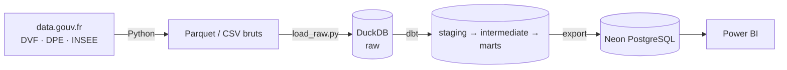

# Open Data Logement

**Où l'immobilier est-il cher par rapport aux revenus locaux, et quel rôle joue la performance énergétique ?**

Pipeline ELT sur données publiques françaises (DVF, DPE ADEME, INSEE), avec un dashboard Power BI à la fin.
Projet inspiré du n°12 « ETL Open Data Gouvernement » de [pimp-your-portfolio](https://github.com/gpenessot/pimp-your-portfolio).

## Architecture



| Couche | Outil | Rôle |
|---|---|---|
| Ingestion | Python (stdlib) | Téléchargement idempotent des fichiers sources |
| Warehouse | DuckDB | Stockage local, analytique, sans serveur |
| Transformation | dbt-duckdb | Typage, règles métier, agrégats, tests |
| Diffusion | Neon PostgreSQL | Marts finaux exposés à Power BI |
| Visualisation | Power BI Desktop | Dashboard final |

## Sources

| Source | Producteur | Statut |
|---|---|---|
| DVF géolocalisé (ventes immobilières) | DGFiP / Etalab | ✅ intégré |
| DPE logements existants | ADEME | ⏳ phase 2 |
| Filosofi (revenus par commune) | INSEE | ⏳ phase 2 |
| Population légale | INSEE | ⏳ phase 2 |

Périmètre MVP : Hauts-de-France (02, 59, 60, 62, 80), 2021-2025.

## Démarrage (macOS)

```bash
python3 -m venv .venv
source .venv/bin/activate
pip install -r requirements.txt

python ingestion/download_dvf.py     # ~100 Mo pour 5 départements × 5 ans
python ingestion/load_raw.py         # charge data/raw → DuckDB (schéma raw)

cd dbt
dbt build --profiles-dir .           # modèles + tests
dbt docs generate --profiles-dir . && dbt docs serve --profiles-dir .
```

## Modèles dbt

- `stg_dvf_mutations` : typage du brut, grain source.
- `int_ventes_logement` : une ligne par vente d'**un seul** logement (maison ou appartement).
  Exclut les VEFA, adjudications, ventes en bloc et ventes mixtes avec local d'activité, pour que le prix au m² ait un sens.
- `mart_prix_commune_annee` : prix au m² médian, quartiles et volumes par commune × année × type.
  Les cellules de moins de 5 ventes sont signalées (`est_fiable = false`).

## Limites connues

- DVF ne couvre ni l'Alsace, ni la Moselle, ni Mayotte (régime du livre foncier).
- Les prix incluent les dépendances vendues avec le logement (garage, cave).
- Filosofi masque les revenus des petites communes (secret statistique) : à gérer dans les marts.
