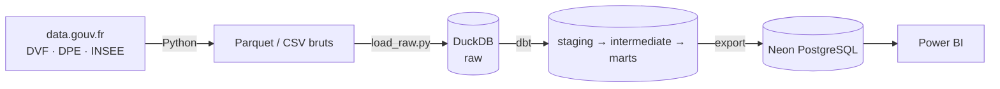
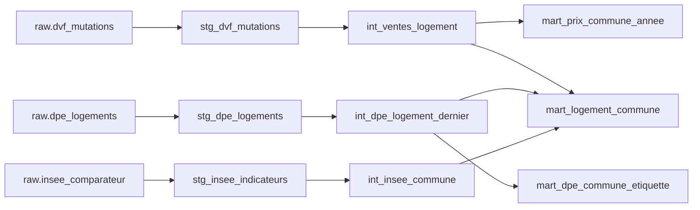
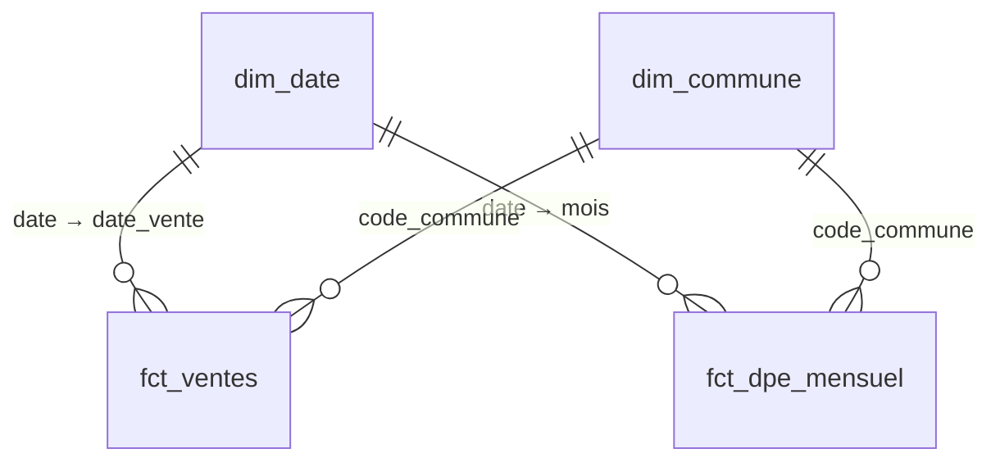

# Open Data Logement

**Où l'immobilier est-il cher par rapport aux revenus locaux, et quel rôle joue la performance énergétique ?**

Pipeline ELT sur données publiques françaises (DVF, DPE ADEME, INSEE), avec un dashboard Power BI à la fin.
Projet inspiré du n°12 « ETL Open Data Gouvernement » de [pimp-your-portfolio](https://github.com/gpenessot/pimp-your-portfolio).

## Architecture



| Couche | Outil | Rôle |
|---|---|---|
| Ingestion | Python (stdlib) | Téléchargement idempotent des fichiers sources |
| Warehouse | DuckDB | Stockage local, analytique, sans serveur |
| Transformation | dbt-duckdb | Typage, règles métier, agrégats, tests |
| Diffusion | Neon PostgreSQL | Marts finaux exposés à Power BI |
| Visualisation | Power BI Desktop | Dashboard final |

## Sources

| Source | Producteur | Statut |
|---|---|---|
| DVF géolocalisé (ventes immobilières) | DGFiP / Etalab | ✅ intégré |
| DPE logements existants (depuis juillet 2021) | ADEME (API data-fair) | ✅ intégré |
| Comparateur de territoires : population, niveau de vie, parc de logements | INSEE | ✅ intégré |

Périmètre MVP : Hauts-de-France (02, 59, 60, 62, 80), 2021-2025.

## Démarrage (macOS)

```bash
python3 -m venv .venv
source .venv/bin/activate
pip install -r requirements.txt

python ingestion/download_dvf.py     # ~100 Mo pour 5 départements × 5 ans
python ingestion/download_insee.py   # ~10 Mo
python ingestion/download_dpe.py     # le plus long ; reprend où il s'est arrêté si on le relance
python ingestion/load_raw.py         # charge data/raw → DuckDB (schéma raw)

cd dbt
dbt build --profiles-dir .           # seeds + modèles + tests
dbt docs generate --profiles-dir . && dbt docs serve --profiles-dir .
cd ..

cp .env.example .env                 # puis y coller la chaîne de connexion Neon
python export/export_neon.py         # marts → Neon (schéma open_data_logement) pour Power BI
```

## Modèles dbt



**Staging** : typage et renommage, grain source.

**Intermediate**
- `int_ventes_logement` : une ligne par vente d'**un seul** logement (maison ou appartement).
  Exclut les VEFA, adjudications, ventes en bloc, ventes mixtes avec local d'activité et ventes sans surface.
- `int_dpe_logement_dernier` : un logement = son DPE le plus récent. Le DPE n'a pas d'identifiant de logement ;
  la clé est reconstruite (adresse BAN + type + surface arrondie). ~30 % des DPE bruts sont des rediagnostics.
- `int_insee_commune` : pivot du format long INSEE, une colonne par indicateur, valeurs sous secret statistique à NULL.

**Marts**
- `mart_prix_commune_annee` : prix au m² médian, quartiles et volumes par commune × année × type.
- `mart_logement_commune` : **table centrale du dashboard**, une ligne par commune — population, niveau de vie,
  prix récents (2024-2025), part de passoires thermiques (F-G), logements vacants, et
  `annees_niveau_vie_pour_acheter` = prix médian d'un logement / niveau de vie médian.
- `mart_dpe_commune_etiquette` : répartition des étiquettes A→G par commune, type et période de construction.

Les indicateurs calculés sur trop peu d'observations sont signalés (`prix_est_fiable`, `dpe_est_fiable`).

### Schéma en étoile (Power BI)



| Table | Grain | Usage |
|---|---|---|
| `fct_ventes` | 1 vente | Prix et volumes ; médianes recalculées en DAX (`MEDIANX`) selon les filtres |
| `fct_dpe_mensuel` | commune × mois × type × période × étiquette | DPE réalisés (flux, additifs) : évolution de la part de passoires |
| `dim_commune` | 1 commune | Attributs INSEE, département (seed `departements`), coordonnées pour les cartes |
| `dim_date` | 1 jour (2021 → fin de l'année en cours) | Intelligence temporelle, libellés en français |

Une médiane ne s'additionne pas : le détail des ventes est exporté pour que Power BI la recalcule
correctement quel que soit le filtre (période, commune, type).

## Limites connues

- DVF ne couvre ni l'Alsace, ni la Moselle, ni Mayotte (régime du livre foncier).
- Les prix incluent les dépendances vendues avec le logement (garage, cave).
- L'INSEE masque le niveau de vie des petites communes (secret statistique) : ~8 % des communes des Hauts-de-France.
- Le DPE ne couvre que les logements diagnostiqués depuis juillet 2021 (ventes, locations) : c'est un échantillon
  du parc, pas le parc entier. La part de passoires se lit « parmi les logements diagnostiqués ».
- Le niveau de vie INSEE est un revenu par unité de consommation : l'indicateur d'accessibilité compare les communes
  entre elles, il ne mesure pas l'effort réel d'un ménage.
- Quelques communes fusionnées depuis 2021 gardent leur ancien code dans DVF/DPE et ne sont pas rattachées
  (alerte dbt `relationships`, quelques dizaines de ventes).
