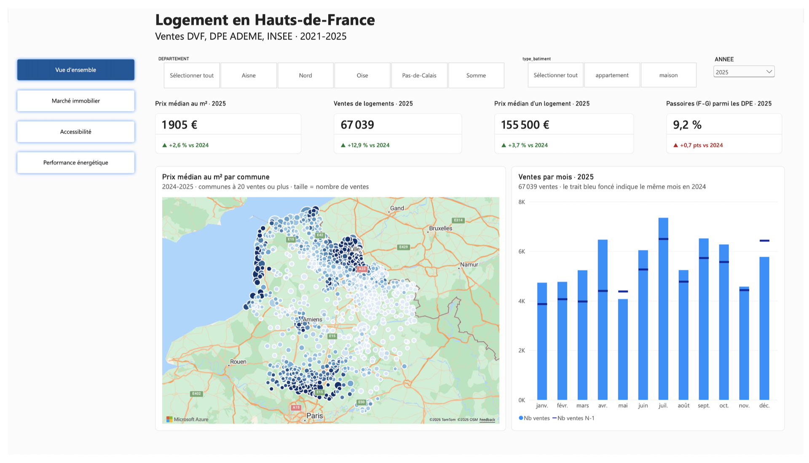
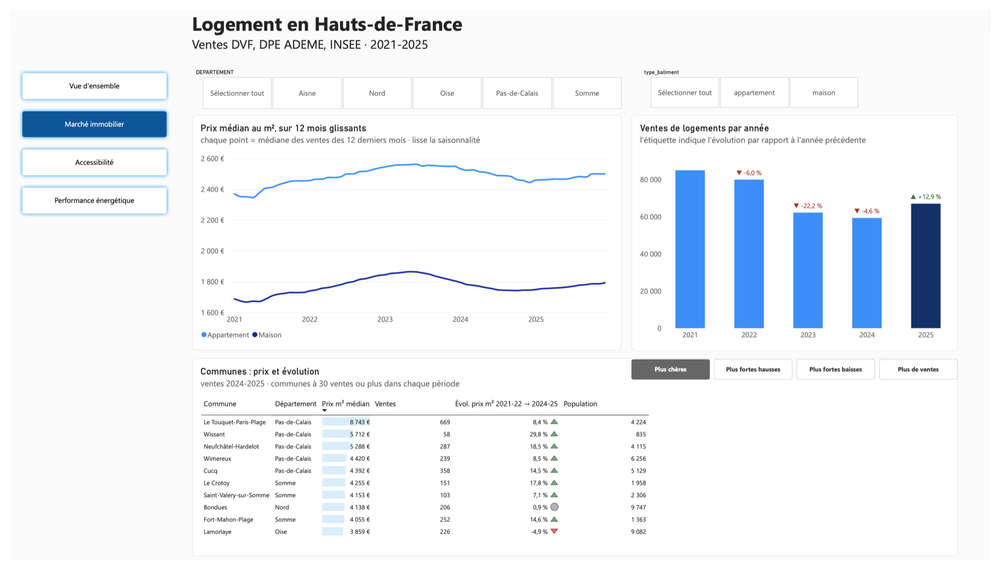
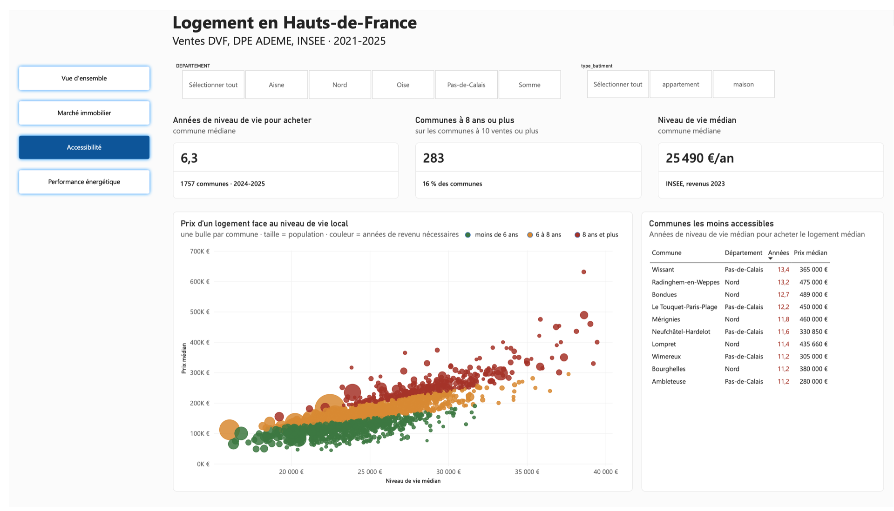
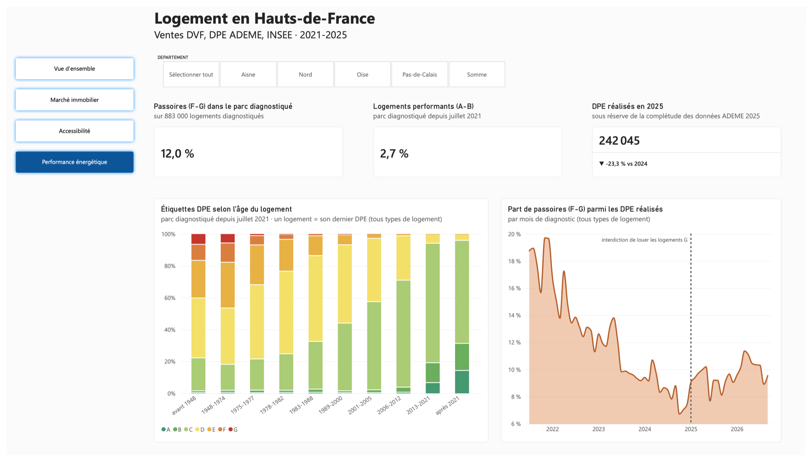
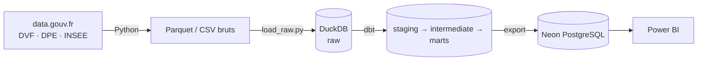
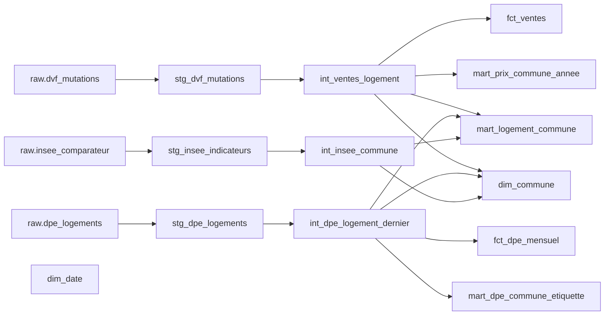
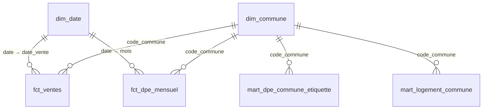

# Open Data Logement

**Où l'immobilier est-il cher par rapport aux revenus locaux, et quel rôle joue la performance énergétique ?**

Pipeline ELT sur données publiques françaises (DVF, DPE ADEME, INSEE), avec un dashboard Power BI à la fin.
Projet inspiré du n°12 « ETL Open Data Gouvernement » de [pimp-your-portfolio](https://github.com/gpenessot/pimp-your-portfolio).

## Le rapport



Quatre pages, construites sur un modèle en étoile et une centaine de mesures DAX.

| Page | Question | Visuels |
| --- | --- | --- |
| Vue d'ensemble | Où en est le marché cette année ? | 4 cartes, carte des communes, ventes mensuelles |
| Marché immobilier | Comment a-t-il évolué sur cinq ans ? | prix 12 mois glissants, ventes par année, top communes |
| Accessibilité | Combien d'années de revenu pour acheter ? | nuage de points DVF × INSEE, communes les moins accessibles |
| Performance énergétique | Dans quel état est le parc ? | étiquettes DPE par âge, part de passoires par mois |

<details>
<summary>Voir les trois autres pages</summary>







</details>

Le rapport complet est aussi disponible en [PDF](docs/rapport-power-bi.pdf).
Les mesures DAX sont versionnées en TMDL dans
`dashboard/Dashboard open data.SemanticModel/definition/tables/` : le rapport est enregistré
au format `.pbip`, donc le modèle et les visuels sont lisibles et diffables en texte.

## Architecture


```mermaid
flowchart LR
    A[data.gouv.fr<br>DVF · DPE · INSEE] -->|Python| B[Parquet / CSV bruts]
    B -->|load_raw.py| C[(DuckDB<br>raw)]
    C -->|dbt| D[(staging → intermediate → marts)]
    D -->|export| E[(Neon PostgreSQL)]
    E --> F[Power BI]
```

| Couche | Outil | Rôle |
|---|---|---|
| Ingestion | Python (stdlib) | Téléchargement idempotent des fichiers sources |
| Warehouse | DuckDB | Stockage local, analytique, sans serveur |
| Transformation | dbt-duckdb | Typage, règles métier, agrégats, tests |
| Diffusion | Neon PostgreSQL | Marts finaux exposés à Power BI |
| Visualisation | Power BI Desktop | Dashboard final |

## Sources

| Source | Producteur | Statut |
|---|---|---|
| DVF géolocalisé (ventes immobilières) | DGFiP / Etalab | ✅ intégré |
| DPE logements existants (depuis juillet 2021) | ADEME (API data-fair) | ✅ intégré |
| Comparateur de territoires : population, niveau de vie, parc de logements | INSEE | ✅ intégré |

Périmètre MVP : Hauts-de-France (02, 59, 60, 62, 80), 2021-2025.

## Démarrage (macOS)

```bash
python3 -m venv .venv
source .venv/bin/activate
pip install -r requirements.txt

python ingestion/download_dvf.py     # ~100 Mo pour 5 départements × 5 ans
python ingestion/download_insee.py   # ~10 Mo
python ingestion/download_dpe.py     # le plus long ; reprend où il s'est arrêté si on le relance
python ingestion/load_raw.py         # charge data/raw → DuckDB (schéma raw)

cd dbt
dbt build --profiles-dir .           # seeds + modèles + tests
dbt docs generate --profiles-dir . && dbt docs serve --profiles-dir .
cd ..

cp .env.example .env                 # puis y coller la chaîne de connexion Neon
python export/export_neon.py         # marts → Neon (schéma open_data_logement) pour Power BI
```

## Modèles dbt


```mermaid
flowchart LR
    R1[raw.dvf_mutations] --> S1[stg_dvf_mutations] --> I1[int_ventes_logement]
    R2[raw.dpe_logements] --> S2[stg_dpe_logements] --> I2[int_dpe_logement_dernier]
    R3[raw.insee_comparateur] --> S3[stg_insee_indicateurs] --> I3[int_insee_commune]
    I1 --> F1[fct_ventes]
    I1 --> M1[mart_prix_commune_annee]
    I2 --> F2[fct_dpe_mensuel]
    I2 --> M3[mart_dpe_commune_etiquette]
    I1 & I2 & I3 --> M2[mart_logement_commune]
    I1 & I2 & I3 --> D2[dim_commune]
    D1[dim_date]
```

**Staging** : typage et renommage, grain source.

**Intermediate**
- `int_ventes_logement` : une ligne par vente d'**un seul** logement (maison ou appartement).
  Exclut les VEFA, adjudications, ventes en bloc, ventes mixtes avec local d'activité et ventes sans surface.
- `int_dpe_logement_dernier` : un logement = son DPE le plus récent. Le DPE n'a pas d'identifiant de logement ;
  la clé est reconstruite (adresse BAN + type + surface arrondie). ~30 % des DPE bruts sont des rediagnostics.
- `int_insee_commune` : pivot du format long INSEE, une colonne par indicateur, valeurs sous secret statistique à NULL.

**Marts**
- `fct_ventes` : une ligne par vente. Grain volontairement fin, voir le schéma en étoile plus bas.
- `fct_dpe_mensuel` : diagnostics réalisés, agrégés au mois × commune × type × période × étiquette.
- `mart_dpe_commune_etiquette` : répartition des étiquettes A→G par commune, type et période de construction,
  sur le parc dédoublonné.
- `dim_commune` : une ligne par commune — population, niveau de vie, parc, coordonnées.
- `dim_date` : calendrier 2021 → fin de l'année en cours, libellés français.
- `mart_prix_commune_annee` : prix au m² médian, quartiles et volumes par commune × année × type.
- `mart_logement_commune` : synthèse par commune (prix récents, part de passoires, accessibilité précalculée).

Les indicateurs calculés sur trop peu d'observations sont signalés (`prix_est_fiable`, `dpe_est_fiable`).

L'ordre chronologique des périodes de construction DPE est porté par la macro
`periode_construction_tri`, appelée par `fct_dpe_mensuel` et `mart_dpe_commune_etiquette` :
la règle n'est écrite qu'une fois.

### Schéma en étoile (Power BI)


```mermaid
erDiagram
    dim_date    ||--o{ fct_ventes                  : "date → date_vente"
    dim_date    ||--o{ fct_dpe_mensuel             : "date → mois"
    dim_commune ||--o{ fct_ventes                  : code_commune
    dim_commune ||--o{ fct_dpe_mensuel             : code_commune
    dim_commune ||--o{ mart_dpe_commune_etiquette  : code_commune
    dim_commune ||--o{ mart_logement_commune       : code_commune
```

Toutes les relations sont en plusieurs-à-un, à sens unique. `dim_date` est marquée comme table de dates.

| Table | Grain | Usage dans le rapport |
|---|---|---|
| `fct_ventes` | 1 vente | prix et volumes ; médianes recalculées en DAX (`MEDIAN`) selon les filtres |
| `fct_dpe_mensuel` | commune × mois × type × période × étiquette | DPE réalisés (**flux**, additifs) : évolution de la part de passoires |
| `mart_dpe_commune_etiquette` | commune × type × période × étiquette | **parc** diagnostiqué (1 logement = son dernier DPE) : étiquettes par âge du bâti |
| `dim_commune` | 1 commune | attributs INSEE, département (seed `departements`), niveau de vie, coordonnées pour les cartes |
| `dim_date` | 1 jour (2021 → fin de l'année en cours) | intelligence temporelle, libellés en français |
| `mart_prix_commune_annee` | commune × année × type | agrégat exposé, non utilisé par les visuels actuels |
| `mart_prix_commune_annee` | commune × année × type | exportée vers Neon, non chargée dans le modèle Power BI |

Deux points de modélisation portent tout le rapport.

**Une médiane ne s'additionne pas.** Impossible de précalculer une médiane par commune puis de l'agréger
au département. Le détail des ventes est donc exporté tel quel, 353 702 lignes, pour que Power BI recalcule
la valeur juste quel que soit le filtre (période, commune, type). C'est aussi pourquoi les deux marts
agrégées restent inutilisées : elles répondaient au besoin avant ce constat.

**Le parc et le flux ne comptent pas la même chose.** `mart_dpe_commune_etiquette` compte chaque logement
une fois, avec son dernier DPE ; `fct_dpe_mensuel` compte chaque diagnostic réalisé. Les confondre
donnerait des pourcentages faux, puisqu'un logement rediagnostiqué apparaît deux fois dans le flux.

## Limites connues

- DVF ne couvre ni l'Alsace, ni la Moselle, ni Mayotte (régime du livre foncier).
- Dans DVF, le prix d'une mutation est répété sur chaque ligne : les ventes multi-lots sont écartées
  plutôt que réparties arbitrairement.
- Les prix incluent les dépendances vendues avec le logement (garage, cave).
- L'INSEE masque le niveau de vie des petites communes (secret statistique) : ~8 % des communes des Hauts-de-France.
- Les revenus INSEE datent de 2023, les prix de 2024-2025 : le comparateur publie avec deux ans de décalage.
- Le DPE ne couvre que les logements diagnostiqués depuis juillet 2021 (ventes, locations) : c'est un échantillon
  du parc, pas le parc entier. La part de passoires se lit « parmi les logements diagnostiqués ».
- Le niveau de vie INSEE est un revenu par unité de consommation : l'indicateur d'accessibilité compare les communes
  entre elles, il ne mesure pas l'effort réel d'un ménage.
- Quelques communes fusionnées depuis 2021 gardent leur ancien code dans DVF/DPE et ne sont pas rattachées
  (alerte dbt `relationships`, quelques dizaines de ventes).
- La collecte ADEME 2025 présente un creux sur plusieurs départements : la baisse du nombre de DPE
  affichée pour cette année reste à confirmer.

## Améliorations identifiées

- **Une dimension conforme `dim_type_logement`.** Le type de bien existe aujourd'hui dans trois tables de faits,
  sous deux orthographes (« Maison » côté ventes, « maison » côté DPE). Conséquence : sur la page Énergie,
  aucun segment de type ne peut filtrer à la fois le parc et le flux. Il a donc été retiré plutôt que de
  laisser un filtre qui n'agit qu'à moitié.
- **Des snapshots dbt** pour conserver l'historique quand l'ADEME corrige un diagnostic : le projet versionne
  aujourd'hui son code, pas ses données.
- **Une GitHub Action hebdomadaire** pour relancer ingestion, `dbt build` et export, avec échec visible si un test tombe.
